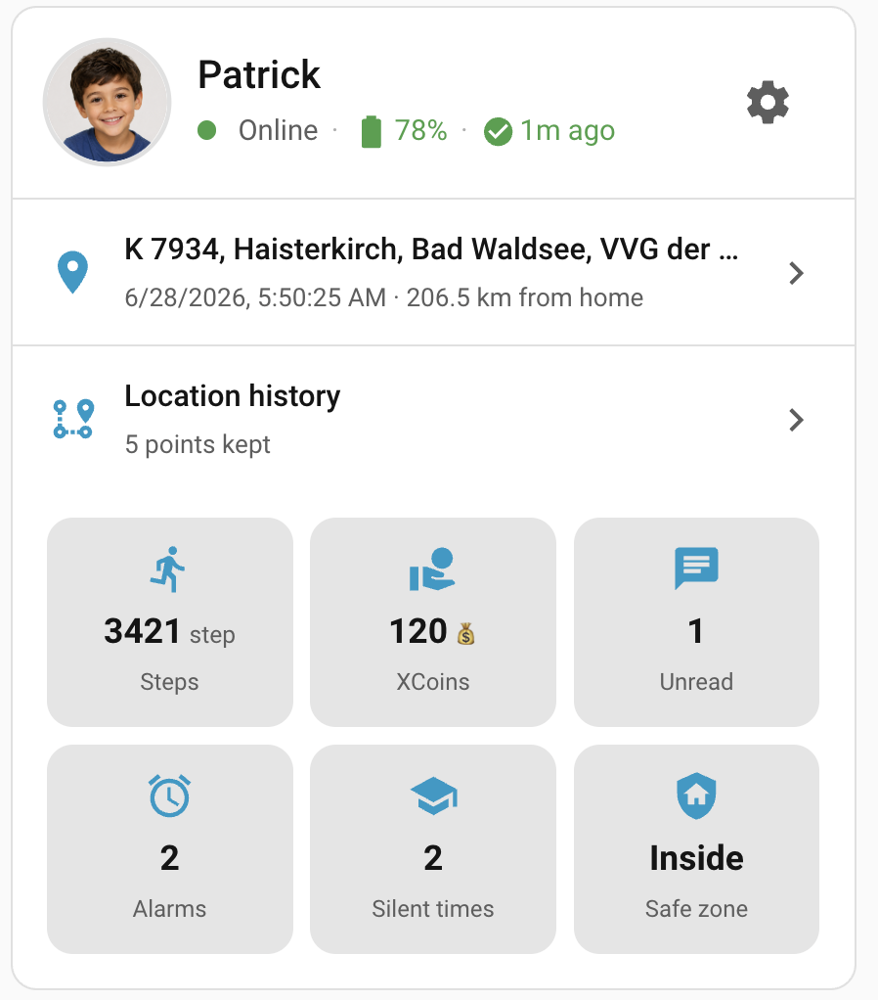
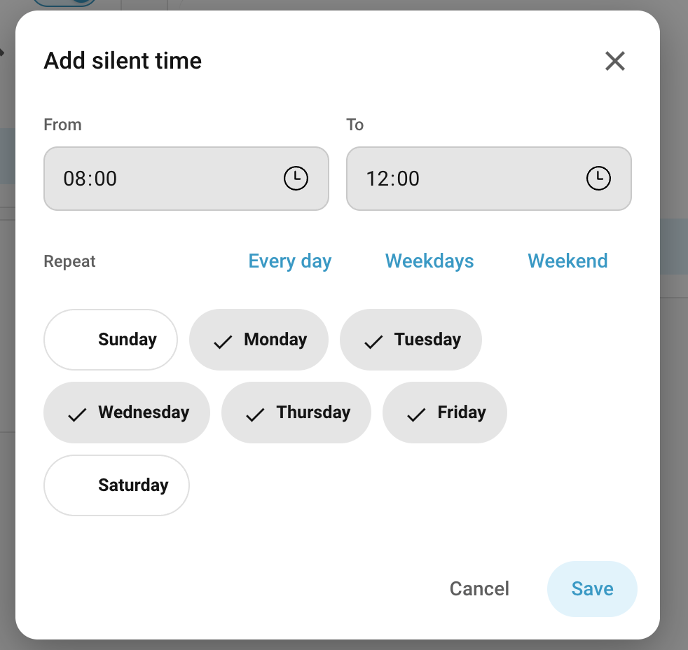

# HA Xplora® Watch

HA Xplora® Watch integration for Home Assistant

[](https://my.home-assistant.io/redirect/hacs_repository/?owner=distante&repository=ha-xplora-watch&category=integration)\
[](https://github.com/hacs/integration)
[](https://github.com/distante/ha-xplora-watch/releases)

[](LICENSE)
[](https://github.com/distante/ha-xplora-watch/issues)\
[](https://github.com/astral-sh/ruff)\
[](https://github.com/distante/ha-xplora-watch/actions/workflows/test.yml)
[](https://github.com/distante/ha-xplora-watch/actions/workflows/lint.yml)
[](https://github.com/distante/ha-xplora-watch/actions/workflows/validate.yml)
[](https://github.com/distante/ha-xplora-watch/actions/workflows/test.yml)

[](https://paypal.me/saninn)

> **Built to keep your account safe.** This is a fork of the excellent [Ludy87/xplora_watch](https://github.com/Ludy87/xplora_watch) — full credit to @Ludy87 for building the original and figuring out the Xplora API in the first place. Over time Xplora tightened its rate-limits, and the talk-to-the-server-often patterns that used to be fine started getting accounts throttled and banned. This fork reworks how the integration talks to Xplora so that's no longer a risk: it **logs in once** and reuses that session for ~35 days, **consolidates** the per-refresh calls (and caches what doesn't change — locations, chat media), and ships with **polling off by default**, so out of the box it talks to Xplora's servers **only when you ask it to**. Safe by default, nothing to tune.

---


## Overview

The bundled Lovelace overview card surfaces a watch's online/charging state, battery, last-known
location, steps, XCoins, unread messages, alarms, silent times and safe-zone status at a glance:



Tapping the location row opens a live map with the watch's last-known position and a refresh button:


Tapping the **Location history** row opens a date bar and a map track of where the watch has been on
a given day — see [Location history](#location-history).

## Migrating from the original Ludy87/xplora_watch integration

This fork keeps the same integration domain (`xplora_watch`) and the same config-entry version as
the original, so it's installed **in place of** it, not alongside it — your existing config entry,
login, and entities carry over. You do **not** need to remove and re-add the integration or
re-enter your credentials.

**What's handled automatically** the first time Home Assistant starts on the new code:

- Entity unique IDs are reformatted to the current naming scheme. Legacy dash/space-separated
  unique IDs are rewritten to the underscore-separated form used today; entity IDs, history, and
  customizations are preserved — only the internal unique ID changes.
- The old per-watch alarm/silent `switch.*` entities are removed. They were replaced by the
  `*_alarms` / `*_silents` sensors described in [Alarms & Silent Times](#alarms--silent-times). If
  you have automations, scripts, or dashboards referencing the old switches, point them at the new
  sensors (see that section for the attribute layout).
- A previously configured polling interval is kept, but snapped to the nearest
  [supported preset](#update-interval-polling) (30 minutes minimum) — it is **not** reset to "off".
  Polling-off is only the default for brand-new installs; upgrades keep polling, just at a safer
  interval.

**What you still need to do yourself:**

1. Back up your Home Assistant instance before upgrading, as you would for any integration update.
2. If you added the original as a HACS custom repository (pointing at `Ludy87/xplora_watch`),
   remove that custom repository and add this one (`distante/ha-xplora-watch`) instead — HACS
   tracks repositories by URL, not by integration domain, so it won't follow the fork on its own.
   If you installed manually, just replace the contents of `custom_components/xplora_watch/`.
3. Restart Home Assistant once after upgrading so the entity/option migrations above can run.
4. Open the integration's **Options** afterward and review the settings this fork adds: the scan
   interval is now a fixed dropdown of presets (instead of a free-form number) and there's a new
   "Mark chat messages as read while polling" toggle (`auto_mark_read`, default off).
5. For the rate-limit-safe behavior this fork exists to provide, consider setting the scan interval
   to **Off** and driving updates via the `xplora_watch.see` service on your own schedule instead of
   keeping a migrated polling interval — see [Update interval (polling)](#update-interval-polling).

## Features

- Control your watch from Home Assistant
- Receive notifications from your watch
- Track your watch's location
- View your watch's [location history](#location-history) (where it has been)
- View your watch's battery level
- And more!

**IMPORTANCE: Of a service is activated by automation, the sensors will no longer be updated. Therefore, activate the `xplora_watch.see` service with a corresponding interval.**

| Features                                                                                             | Type           |
| ---------------------------------------------------------------------------------------------------- | -------------- |
| Battery                                                                                              | Sensor         |
| Watch-Xcoin                                                                                          | Sensor         |
| Watch Step per Day                                                                                   | Sensor         |
| Watch Online state                                                                                   | Binary Sensor  |
| Watch is in Safezone                                                                                 | Binary Sensor  |
| charging state                                                                                       | Binary Sensor  |
| [Watch alarm(s)](#alarms--silent-times)                        | Sensor + Services |
| [Watch silent time(s)](#alarms--silent-times)                  | Sensor + Services |
| [Send Message](#send-message)                                  | Notify         |
| [Send Message Service](#send-message-via-service-v203)         | Service        |
| [Read Messages from Account](#read-messages-from-account-v240) | Service        |
| [Delete Messages from App](#delete-messages-from-app-v260)     | Service        |
| [Manually update](#manually-update-v208--v209)                 | Service        |
| Turn off Watch                                                                                       | Service        |
| Watch Tracking                                                                                       | Device Tracker |
| Watch Show Safezone(s)                                                                               | Device Tracker |
| [Location history](#location-history)                          | Sensor + Service + Card |

---

## Installation

### MANUAL INSTALLATION

Copy the xplora_watch [last Release](https://github.com/distante/ha-xplora-watch/releases) folder and all of its contents into your Home Assistant's custom_components folder. This folder is usually inside your /config folder. If you are running Hass.io, use SAMBA to copy the folder over. If you are running Home Assistant Supervised, the custom_components folder might be located at /usr/share/hassio/homeassistant. You may need to create the custom_components folder and then copy the xplora_watch folder and all of its contents into it. Alternatively, you can install xplora_watch through HACS by adding this repository.

### INSTALLATION mit HACS

1. Ensure that [HACS](https://hacs.xyz/) is installed.
2. Search for and install the "**HA Xplora® Watch**" integration. [](https://github.com/distante/ha-xplora-watch/releases)
3. [Configuration for the "HA Xplora® Watch" integration is now performed via a config flow as opposed to yaml configuration file.](#basis-configuration)

---

## Basis Configuration

1. Go to HACS -> Integrations -> Click "+"
2. Search for "HA Xplora® Watch" repository and add to HACS
3. Restart Home Assistant when it says to.
4. In Home Assistant, go to Configuration -> Integrations -> Click "+ Add Integration"
5. Search for "HA Xplora® Watch" and follow the instructions to setup.

HA Xplora® Watch should now appear as a card under the HA Integrations page with "Configure" selection available at the bottom of the card.

---

## Update interval (polling)

- Polling is the integration's only standing source of rate-limit/ban risk, so it is **off by
  default** (no recurring cloud calls). The update interval is chosen from a small set of safe
  presets: **Off / Every 30 minutes / Every hour / Every 2 hours** (in the integration's
  _Options_).
- With polling **Off**, data refreshes only when you call the `xplora_watch.see` service. For
  faster or conditional updates, create your own automation that calls `xplora_watch.see` on
  whatever schedule/trigger you want (and accept the corresponding ban risk):

  ```yaml
  # Example: refresh every 10 minutes only while someone is home
  automation:
    - alias: Xplora refresh
      trigger:
        - platform: time_pattern
          minutes: "/10"
      condition:
        - condition: state
          entity_id: zone.home
          state: "1"   # at least one person home
      action:
        - service: xplora_watch.see
          data:
            target: ["all"]
            user: ["<entry_id> (<username>)"]
  ```

- Existing installs are migrated automatically: a previously configured interval is snapped to
  the nearest preset the next time you open _Options_ (anything faster than 30 minutes becomes
  30 minutes).

### Alarms / silent times / safe zones interval

Alarms, silent-time windows and safe-zone definitions can't be bundled into the main status
fetch (Xplora serves each from its own per-watch request), but they rarely change — so they have
their **own** interval in _Options_, **"Alarms/silent/safe-zone refresh"**:
**Off (manual only) / Every 6 hours / Daily / With every poll**, defaulting to **Off**.

- With it **Off**, this data is fetched once and then reused, so normal polls stay lean. Refresh
  it on demand by calling the `xplora_watch.refresh_functions` service, or simply by **tapping the
  alarms/silent count on the overview card** (which opens the management list and refreshes it).
- The alarm/silent edit services (create/update/delete/enable) always refresh their own list
  immediately, so changes you make show up regardless of this setting.

### Auto-mark messages as read

- A separate _Options_ toggle, **"Mark chat messages as read while polling"** (default **off**),
  controls whether fetched chat messages are marked read on Xplora's servers. Leaving it off
  preserves the unread-message count and avoids extra write traffic.

---

## Why this fork exists: the ban problem and solution

The original [Ludy87/xplora_watch](https://github.com/Ludy87/xplora_watch) did the hard work of making Xplora watches usable in Home Assistant at all. As Xplora tightened its rate-limits over time, the original's chattier API patterns started leading to throttling and bans. This fork reworks those patterns to be a good citizen of a service that, frankly, works well — through three changes:

- **No per-poll re-login.** The biggest driver of the bans: the old client logged in *again* on every single poll. This fork logs in **once** and reuses the session token for its full lifetime (~35 days); a real login only happens when the token actually expires. This is the change that matters most.
- **Polling off by default.** New installs make **no recurring calls at all** — data refreshes only when you call `xplora_watch.see` (manually or from your own automation). If you do opt into polling, it's a safe preset (30 min / 1 hour / 2 hours), never a tight loop.
- **Fewer calls per refresh.** Account-wide status (battery, location, online, steps, unread count, …) comes from a single consolidated request, and the rarely-changing alarm/silent/safe-zone data has its own [interval](#alarms--silent-times--safe-zones-interval) that defaults to *off* (refresh on demand). Redundant calls that re-fetched data already in hand were removed, and reverse-geocoding is cached, so a watch that hasn't moved is never looked up twice.
- **Nothing is downloaded twice.** Chat attachments (voice, image, video) are fetched from Xplora once and then served from the local `config/www/…` copy — re-reading a thread never re-downloads media you already have. And concurrent refreshes that ask for the same thing (two cards rendering at once, a button press racing a scheduled poll) are coalesced onto a *single* network request instead of each hitting the API.

### By the numbers

A request count derived from the actual code paths (old = the unpatched upstream client at tag `2.12.9`; counts exclude the retry loops the old client added, so they are conservative floors). One watch:

| | Old integration | This fork |
| --- | --- | --- |
| Logins per refresh | **≥ 1** (every poll) | **0** (token reused ~35 days) |
| Xplora requests per refresh | **~28** | **~3** (lean default) … **~8** (everything enabled) |
| Default poll cadence | every 180 s (480/day) | **off** (0/day until you ask) |
| Busiest possible day | **~13,400 requests + ≥480 logins** (at the 180 s default; far higher on its free-form slider) | **~384 requests, 0 logins** (fastest 30-min preset, everything on) |

So this fork's *worst* day is roughly **35× lighter** than the old integration's *idle, default* day — and it removes the per-refresh login that actually triggered the bans.

**The goal is not to trick or evade Xplora's rate limits** — it's to use the API responsibly so accounts stay healthy and the integration remains viable for everyone. The default configuration talks to Xplora's servers only when *you* ask it to.

---

## Downloaded from voice messages, Videos and Images

- All voice messages, videos and images are stored in `config/www/{voice|video|image|}`.
  - The voice message will be downloaded as amr and converted to mp3.
  - Videos as mp4 (plus a jpeg thumbnail)
  - Images as jpeg
- **Each attachment is downloaded only once.** Before fetching a voice/image/video from Xplora, the integration checks for the already-cached file under `config/www/…` and skips the (rate-limited) remote download if it's there. Re-reading a chat thread — whether from the card's refresh button, a service call, or render-on-refresh — re-downloads nothing you already have. (A video is only treated as cached once *both* the mp4 and its thumbnail are present.)

---


## Alarms & Silent Times

> **⚠️ Breaking change:** the per-entry `switch.*_alarm_*` / `switch.*_silent_*` entities have been
> **removed**. Each watch's alarms and silent-time windows are now exposed as **two stable list
> sensors** instead, and are managed through **services** (and an optional dashboard card). The old
> switches appeared and disappeared as the lists changed on the watch and could only be toggled;
> the new model lets you **view, create, edit, delete and enable/disable** entries from the UI
> without entities churning. The old `switch.*_alarm_*` / `switch.*_silent_*` registry entries are
> **removed automatically** the first time the upgraded integration starts (restart Home Assistant
> after updating), and any dashboard card that referenced them should be replaced with the new
> [card](#custom-dashboard-card).

### Sensors

Per watch (both **disabled by default** — enable them on the device page):

| Sensor               | State              | Key attributes                                                            |
| -------------------- | ------------------ | ------------------------------------------------------------------------- |
| `sensor.<watch>_alarms`  | number of alarms   | `alarm`: list of `{id, name, start, weekRepeat, weekdays, days, status}`  |
| `sensor.<watch>_silents` | number of silents  | `silent`: list of `{id, start, end, weekRepeat, weekdays, days, status}`  |

Each entry carries the `id` you pass to the update/delete/enable services, the time(s) as `HH:MM`,
and the repeat days in three forms: `weekRepeat` (raw 7-char `0`/`1` string, index 0 = Sunday),
`weekdays` (canonical keys, e.g. `["mon","tue"]`) and `days` (localized, e.g. `Mon, Tue`).

### Services

| Service                          | Purpose                                  |
| -------------------------------- | ---------------------------------------- |
| `xplora_watch.create_alarm`      | Create an alarm                          |
| `xplora_watch.update_alarm`      | Change an alarm's time / days / name     |
| `xplora_watch.delete_alarm`      | Delete an alarm                          |
| `xplora_watch.set_alarm_enabled` | Enable or disable an alarm               |
| `xplora_watch.create_silent`     | Create a silent-time window              |
| `xplora_watch.update_silent`     | Change a silent window's start/end/days  |
| `xplora_watch.delete_silent`     | Delete a silent-time window              |
| `xplora_watch.set_silent_enabled`| Enable or disable a silent-time window   |
| `xplora_watch.turn_all_alarms_on` / `..._off`  | Enable or disable **every** alarm on the watch(es) in one call         |
| `xplora_watch.turn_all_silents_on` / `..._off` | Enable or disable **every** silent-time window on the watch(es) in one call |

Common fields: `target` (the watch) and `user` (the account) are picked from dropdowns in the UI,
exactly like the other services. Times (`start`, `end`) are `HH:MM`; `weekdays` is a list of
`mon`,`tue`,`wed`,`thu`,`fri`,`sat`,`sun`. The `turn_all_*` services only need `target` + `user`
(they enumerate every entry themselves). The `alarm_id` / `silent_id` for updates and deletes come
from the matching sensor's attributes — or, more easily, from the **copy buttons on the dashboard
card** (see below), which hand you the id or a complete, ready-to-paste service call.

```yaml
# Create a school-night silent window, 22:00–07:00, Mon–Fri
service: xplora_watch.create_silent
data:
  target:
    - 01102f442f1125f525f5f3336316068        # watch id
  user:
    - "<entry_id> (Parent Name)"             # account (entry id), as offered in the dropdown
  start: "22:00"
  end: "07:00"
  weekdays: [mon, tue, wed, thu, fri]
```

```yaml
# Disable a single alarm (alarm_id taken from sensor.<watch>_alarms attributes)
service: xplora_watch.set_alarm_enabled
data:
  target:
    - 01102f442f1125f525f5f3336316068
  user:
    - "<entry_id> (Parent Name)"
  alarm_id: alarm-123
  enabled: false
```

```yaml
# Silence everything for the day (e.g. a school holiday) — no per-entry ids needed
service: xplora_watch.turn_all_silents_off
data:
  target:
    - 01102f442f1125f525f5f3336316068
  user:
    - "<entry_id> (Parent Name)"
```

> **Note (polling off by default):** with polling disabled, a successful create/update/delete/toggle
> refreshes only that one list, so the sensor reflects the change immediately without triggering a
> full account poll.

### Custom dashboard card

The integration bundles a dependency-free Lovelace card and registers it automatically (no manual
resource needed). Add it from the card picker (**Xplora Watch Alarms / Silent Times**) or via YAML,
pointing it at one of the list sensors. It renders each entry with its time and days, a toggle to
enable/disable, edit/delete buttons, and an **Add** form — all wired to the services above.

Each row's **⋮ (more)** menu has three **copy** options, so you can build automations without
hunting for ids:

- **Copy ID** — the raw `alarm_id` / `silent_id`.
- **Copy service call** — a complete, paste-ready `set_alarm_enabled` / `set_silent_enabled`
  automation action with `user`, `target`, the id and the current `enabled` state already filled in
  (no need to guess the `user: ["<entry_id> (<name>)"]` convention).
- **Copy payload** — the `create_alarm` / `create_silent` service-data needed to reproduce that
  entry on another watch.

The card header's own **⋮ (more)** menu has **Enable all** / **Disable all**, which call the
`turn_all_alarms_*` / `turn_all_silents_*` services for the watch the card is bound to.

```yaml
type: custom:xplora-watch-card
entity: sensor.kid_one_watch_silents   # an *_alarms or *_silents sensor
title: Silent times                    # optional
```

Pointed at an `*_alarms` sensor it renders the watch's alarms, each with its time, days and an
enable/disable toggle, plus an **Add alarm** form:

| Alarms card                            | Add alarm                            |
| -------------------------------------- | ------------------------------------ |
|  |  |

Pointed at a `*_silents` sensor it renders the silent-time windows (start–end) the same way, with
an **Add silent time** form:

| Silent times card                          | Add silent time                          |
| ------------------------------------------ | ---------------------------------------- |
|  |  |

#### Common tasks

**Turn an alarm/silent time on or off by hand.** Use the toggle switch on the card row — that's it,
no automation needed.

**Build an automation that turns a specific alarm on/off** (e.g. disable the school alarm during the
holidays):

1. Add the **Alarms** (or **Silent Times**) card and point it at the watch's `*_alarms` /
   `*_silents` sensor.
2. On the row you want, open the **⋮** menu → **Copy service call**. This puts a ready-to-use
   action on your clipboard, with the watch, account and entry id already filled in.
3. Create an automation, switch the action editor to **YAML mode**, and paste. Flip `enabled: true`
   to `false` (or vice-versa) for what you want it to do. Example of what you'll paste:

   ```yaml
   action: xplora_watch.set_alarm_enabled
   data:
     user:
       - "<entry_id> (Parent Name)"
     target:
       - 01102f442f1125f525f5f3336316068
     alarm_id: alarm-123
     enabled: false
   ```

4. Add your trigger (a time, a calendar, an `input_boolean`, …) and save.

> **Tip:** **Copy ID** gives you just the `alarm_id` / `silent_id` if you'd rather build the action
> from scratch, and **Copy payload** gives you the `create_alarm` / `create_silent` data to clone an
> entry onto another watch.

**Turn *all* alarms or silent times on/off at once.** Either click the card header's **⋮** menu →
**Enable all** / **Disable all**, or call the bulk service from an automation (no ids needed):

```yaml
# Silence every window on a school holiday, restore them in the evening
action: xplora_watch.turn_all_silents_off
data:
  user:
    - "<entry_id> (Parent Name)"
  target:
    - 01102f442f1125f525f5f3336316068
```

The matching `turn_all_alarms_on` / `turn_all_alarms_off` / `turn_all_silents_on` services work the
same way. Set `target` to `all` to apply it to every watch on the account.

#### Chat card

A messenger-style view of one watch's chat history with a box to send a new message — so you can
read and reply without calling services by hand. Add it from the card picker (**Xplora Watch
Chat**) or via YAML, pointing it at the watch's `*_message` sensor:

```yaml
type: custom:xplora-watch-chat-card
entity: sensor.kid_one_watch_message   # the watch's *_message sensor
title: Messages                        # optional
```

Messages are shown as bubbles (left = from the watch, right = sent from Home Assistant), oldest at
the top. Text and emoji are shown inline, and voice, image and video attachments are rendered from
the media the integration downloads on refresh. Type in the box and press **Enter** (or the send
button) to send;
the refresh button re-reads the thread (and fetches any new attachments). A full-screen button
expands the chat to fill the screen — handy for long histories on a phone. The card opens straight
from the **Unread** tile of the overview card too.

> [!NOTE]
> The `*_message` sensor is **disabled by default** — enable it on the watch's device page before
> adding the card. The card shows a placeholder until the sensor is available, and fetches the
> thread automatically the first time it opens with nothing cached.


---

## Location history

The phone app shows where the watch has been during the day as a map track (about the last 3 days).
Home Assistant can show the same — and keep **much more** than the app does — through an optional
**location-history sensor** plus a map view in the overview card.

> [!NOTE]
> The `sensor.<watch>_location_history` sensor is **disabled by default** (like the message sensor).
> Enable it on the watch's device page first. While it is disabled the integration makes **zero**
> extra requests for history, keeping the [ban-safe default](#why-this-fork-exists-the-ban-problem-and-solution).

### How it works

- **Today's** track is fetched on demand when you open the Location history view (and always shown
  fresh there). It is deliberately kept **off** the regular `xplora_watch.see` / polling cycle, so a
  normal location update never adds a history request — opening the view (or a manual refresh) is what
  pulls today.
- The watch's backend only serves roughly the **last 3 days**. To build a longer archive, call the
  **`xplora_watch.fetch_history`** service once a day (it defaults to *yesterday*). Everything it
  fetches is cached locally and kept for the configured **retention** (default **14 days**, range
  1–90; change it under the integration's **Configure** dialog → *History retention (days)*).
- The sensor's **state** is the number of recent points (last 24 h, capped) — small and
  recorder-safe. The full per-day tracks live in HA storage and are read on demand by the card, so
  they never bloat the recorder database.
- All dates and times are shown in the **watch's** timezone.

### Viewing the track in the overview card

Tap the **Location history** row on the [overview card](#overview) to open the history view:

- A date bar — `‹  28.06.2026  ›  Today` — sits at the top. The **arrows** step through the days that
  have data; the **Today** button jumps back to the latest day.
- Tapping the **date** opens a month **calendar** that highlights the days with data (the recent days
  plus everything you have archived); pick any highlighted day to load it.
- The selected day's track is drawn as a polyline on the map below. Today is always re-fetched fresh;
  past days come from the local cache (no network) once they have been fetched.


### Keeping a long archive (daily automation)

Run `xplora_watch.fetch_history` once a day so the archive grows beyond what the watch serves:

```yaml
# Archive yesterday's track every morning at 03:00
alias: Xplora archive location history
trigger:
  - platform: time
    at: "03:00:00"
action:
  - service: xplora_watch.fetch_history
    data:
      target:
        - 01102f442f1125f525f5f3336316068    # watch id
      user:
        - "<entry_id> (Parent Name)"         # account (entry id), as offered in the dropdown
      # date: "2026-06-25"                    # optional; omit to fetch yesterday (YYYY-MM-DD)
```

`target` (the watch) and `user` (the account) are picked from dropdowns in the UI, exactly like the
other services. Omit `date` to archive yesterday; pass a `YYYY-MM-DD` date to backfill a specific day
the watch still serves. Increase **History retention (days)** in the **Configure** dialog to keep
more than the default two weeks.

---

## Send Message

> **⚠️ Breaking change:** `notify.xplora_watch` has been **removed**. Use the `xplora_watch.send_message` service instead (available in the HA developer tools UI, where the `user` dropdown is pre-populated from your configured accounts).

```yaml
service: xplora_watch.send_message
data:
  user:
    - "<entry_id> (<username>)"
  message: "Hello!"
  target:
    - "<watch_wuid>"   # or "all" to target every watch in the entry
```


## Debug

```yaml
logger:
  logs:
    custom_components.xplora_watch: debug
```
