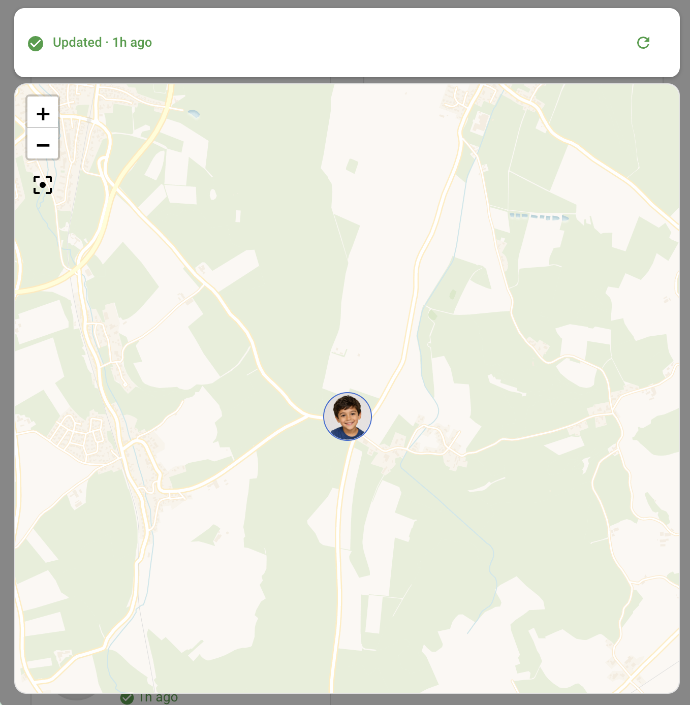
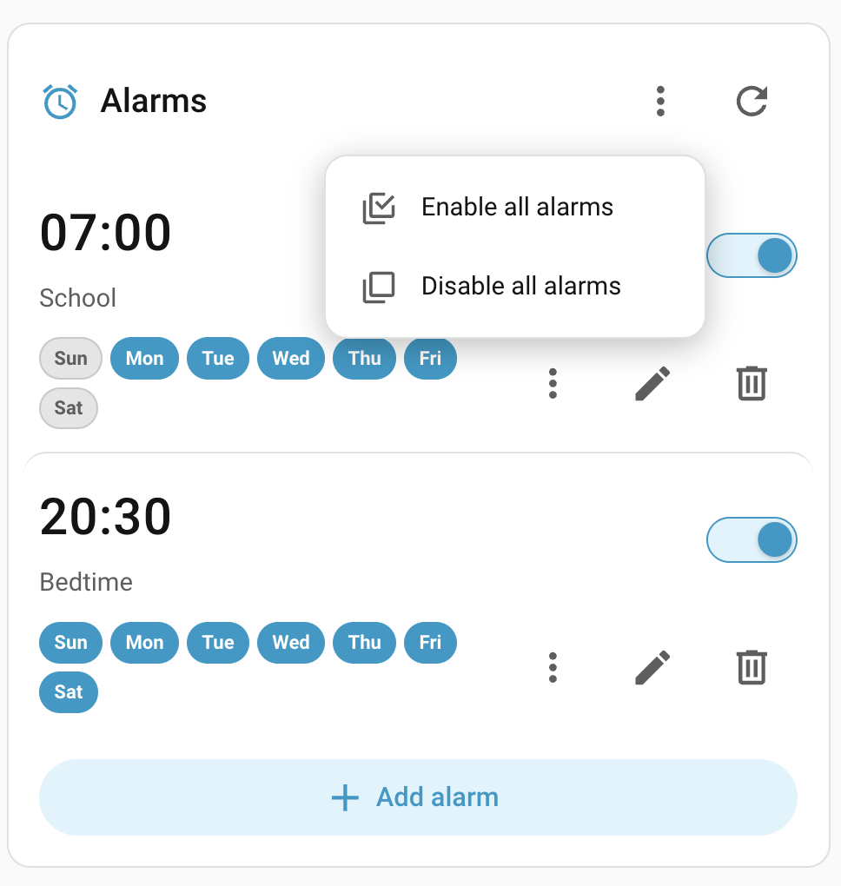
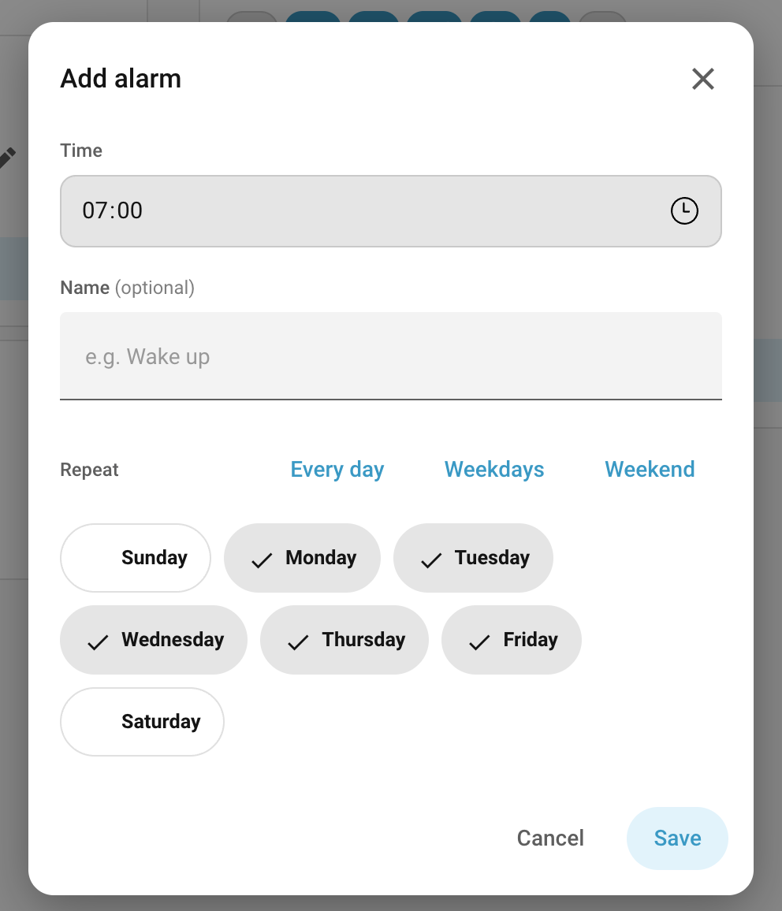
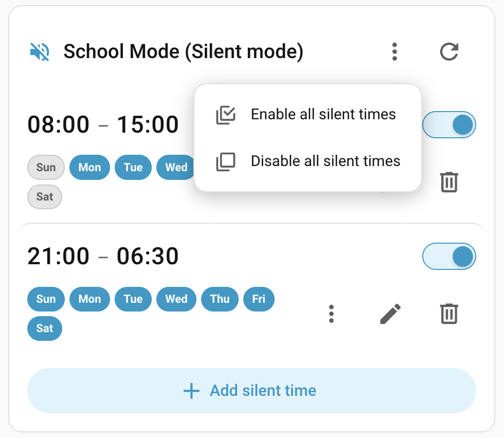
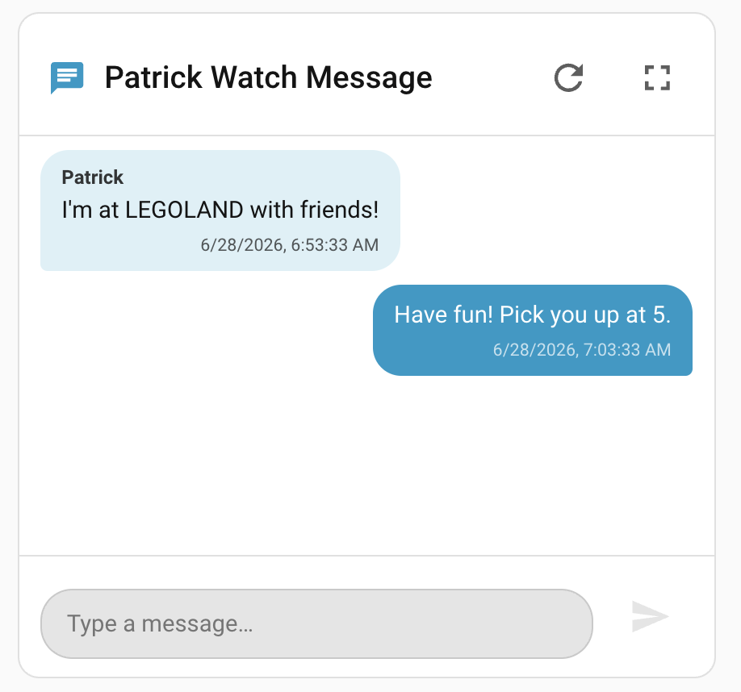
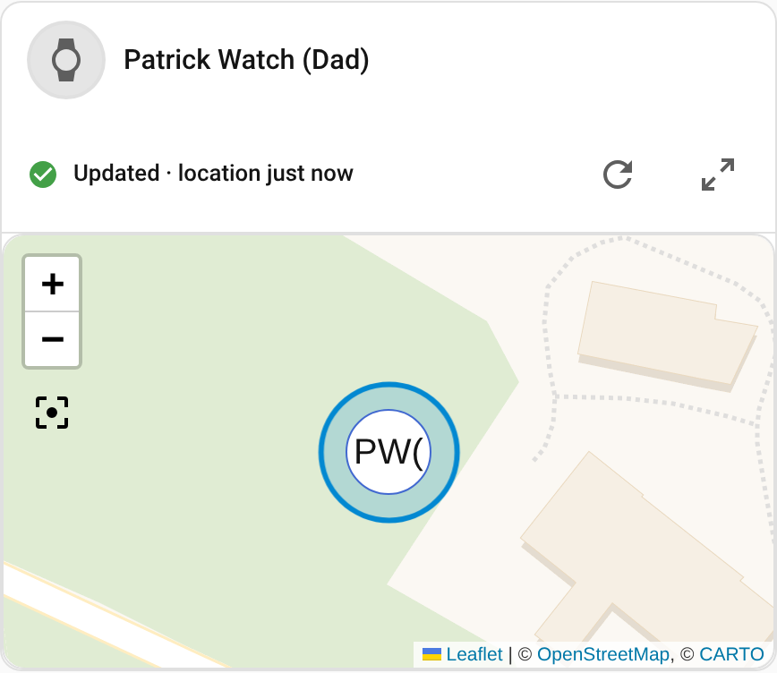

# Dashboard cards

The integration bundles several dependency-free Lovelace cards and registers them automatically —
no manual resource needed. Add any of them from the card picker or via YAML.

## Overview card

Surfaces a watch's online/charging state, battery, last-known location, steps, XCoins, unread
messages, alarms, silent times and safe-zone status at a glance:


Tapping the location row opens a live map with the watch's last-known position and a refresh button:



Tapping the **Location history** row opens a date bar and a map track of where the watch has been
on a given day — see [Location history](location-history.md).

## Alarms & Silent Times card

Point the bundled alarms/silent-times card at one of the list sensors from
[Alarms & Silent Times](alarms-and-silent-times.md) and it renders each entry with its time and
days, a toggle to enable/disable, edit/delete buttons, and an **Add** form — all wired to the
services documented there.

Each row's **⋮ (more)** menu has three **copy** options, so you can build automations without
hunting for ids:

- **Copy ID** — the raw `alarm_id` / `silent_id`.
- **Copy service call** — a complete, paste-ready `set_alarm_enabled` / `set_silent_enabled`
  automation action with the watch target, the id and the current `enabled` state already filled in.
- **Copy payload** — the `create_alarm` / `create_silent` service-data needed to reproduce that
  entry on another watch.

The card header's own **⋮ (more)** menu has **Enable all** / **Disable all**, which call the
`turn_all_alarms_*` / `turn_all_silents_*` services for the watch the card is bound to.

```yaml
type: custom:xplora-watch-card
entity: sensor.kid_one_watch_silents   # an *_alarms or *_silents sensor
title: Silent times                    # optional
```

Pointed at an `*_alarms` sensor it renders the watch's alarms, each with its time, days and an
enable/disable toggle, plus an **Add alarm** form:

| Alarms card                            | Add alarm                            |
| --------------------------------------- | -------------------------------------- |
|  |  |

Pointed at a `*_silents` sensor it renders the silent-time windows (start–end) the same way, with
an **Add silent time** form:

| Silent times card                          | Add silent time                          |
| -------------------------------------------- | ------------------------------------------- |
|  |  |

### Common tasks

**Turn an alarm/silent time on or off by hand.** Use the toggle switch on the card row — that's it,
no automation needed.

**Build an automation that turns a specific alarm on/off** (e.g. disable the school alarm during the
holidays):

1. Add the **Alarms** (or **Silent Times**) card and point it at the watch's `*_alarms` /
   `*_silents` sensor.
2. On the row you want, open the **⋮** menu → **Copy service call**. This puts a ready-to-use
   action on your clipboard, with the watch (as its own entity) and the entry id already filled in.
3. Create an automation, switch the action editor to **YAML mode**, and paste. Flip `enabled: true`
   to `false` (or vice-versa) for what you want it to do. Example of what you'll paste:

   ```yaml
   action: xplora_watch.set_alarm_enabled
   target:
     entity_id: sensor.kid_one_watch_alarms   # the card fills in the watch's own entity
   data:
     alarm_id: alarm-123
     enabled: false
   ```

4. Add your trigger (a time, a calendar, an `input_boolean`, …) and save.

> **Tip:** **Copy ID** gives you just the `alarm_id` / `silent_id` if you'd rather build the action
> from scratch, and **Copy payload** gives you the `create_alarm` / `create_silent` data to clone an
> entry onto another watch.

**Turn *all* alarms or silent times on/off at once.** Either click the card header's **⋮** menu →
**Enable all** / **Disable all**, or call the bulk service from an automation (no ids needed):

```yaml
# Silence every window on a school holiday, restore them in the evening
action: xplora_watch.turn_all_silents_off
data:
  device_id: <watch device>
```

The matching `turn_all_alarms_on` / `turn_all_alarms_off` / `turn_all_silents_on` services work the
same way. The **Watch(es)** field is multi-select, so you can apply it to several watches at once.

## Chat card

A messenger-style view of one watch's chat history with a box to send a new message — so you can
read and reply without calling services by hand. Add it from the card picker (**Xplora Watch
Chat**) or via YAML, pointing it at the watch's `*_message` sensor:

```yaml
type: custom:xplora-watch-chat-card
entity: sensor.kid_one_watch_message   # the watch's *_message sensor
title: Messages                        # optional
```

Messages are shown as bubbles (left = from the watch, right = sent from Home Assistant), oldest at
the top. Text and emoji are shown inline, and voice, image and video attachments are rendered from
the media the integration downloads on refresh (see [Voice, video & image messages](media.md)).
Type in the box and press **Enter** (or the send button) to send; the refresh button re-reads the
thread (and fetches any new attachments). A full-screen button expands the chat to fill the screen
— handy for long histories on a phone. The card opens straight from the **Unread** tile of the
overview card too.

> [!NOTE]
> The `*_message` sensor is **disabled by default** — enable it on the watch's device page before
> adding the card. The card shows a placeholder until the sensor is available, and fetches the
> thread automatically the first time it opens with nothing cached.



## Map card

A standalone card that shows **one watch's current location** on a map, right on your dashboard —
no popup needed. Add it from the card picker (**Xplora Watch Map**) or via YAML, pointing it at any
watch entity or the watch's device:



```yaml
type: custom:xplora-watch-map-card
entity: device_tracker.kid_one_watch_tracker   # any watch entity, OR:
# device: 1a2b3c…                              # the watch's device id
title: Kid One                                 # optional (default: the watch's name)
aspect_ratio: "16:9"                           # optional (default "16:9")
show_header: true                              # optional (set false for just the map)
```

The card carries:

- A **fix-age banner** that reports the poll outcome (Updated / Watch didn't respond / Update failed)
  and, separately, **how old the shown position is** — so a stale pin is never mistaken for a live
  one.
- A **reload** button that forces the watch to report a **fresh** position (it presses the watch's
  **Update** button).
- An **expand** button that opens the same map full-screen — the identical map (and reload button)
  you get by tapping the location row on the [overview card](#overview-card).

If you have enabled *Refresh data when a card is shown* (off by default), the map card pulls a fresh
fix on first render — and if you also have the overview card on the same view, the two share a single
request, so adding the map card doesn't increase how often the watch is contacted.

> [!NOTE]
> **The map card is empty or has no reload button.** The card needs the watch's **Update** button
> entity enabled — enable it in Settings → Devices & Services → the watch → the disabled *Update*
> entity. Reload presses that button to fetch a fresh position. A **Contact** account (not the
> watch's Guardian) has no location data at all, so its map card stays empty by design — see
> [Account types](account-types.md).

## Location history card

See [Viewing the track in the overview card](location-history.md#viewing-the-track-in-the-overview-card).
