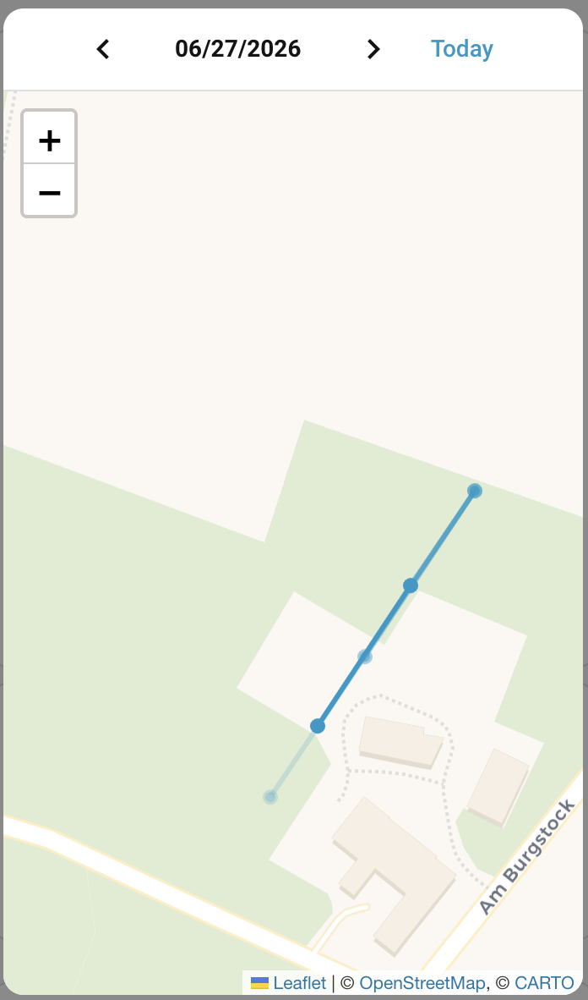
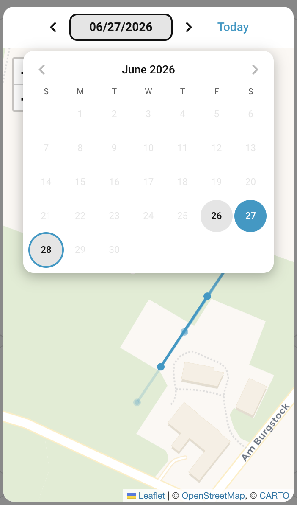

# Location history

The phone app shows where the watch has been during the day as a map track (about the last 3 days).
Home Assistant can show the same — and keep **much more** than the app does — through an optional
**location-history sensor** plus a map view in the overview card.

> [!NOTE]
> The `sensor.<watch>_location_history` sensor is **disabled by default** (like the message sensor).
> Enable it on the watch's device page first. While it is disabled the integration makes **zero**
> extra requests for history, keeping the [ban-safe default](ban-defense.md).

## How it works

- **Today's** track is fetched on demand when you open the Location history view (and always shown
  fresh there). It is deliberately kept **off** the regular `xplora_watch.see` / polling cycle, so a
  normal location update never adds a history request — opening the view (or a manual refresh) is what
  pulls today.
- The watch's backend only serves roughly the **last 3 days**. To build a longer archive, call the
  **`xplora_watch.fetch_history`** service once a day (it defaults to *yesterday*). Everything it
  fetches is cached locally and kept for the configured **retention** (default **14 days**, range
  1–90; change it under the integration's **Configure** dialog → *History retention (days)*).
- The sensor's **state** is the number of recent points (last 24 h, capped) — small and
  recorder-safe. The full per-day tracks live in HA storage and are read on demand by the card, so
  they never bloat the recorder database.
- All dates and times are shown in the **watch's** timezone.

## Viewing the track in the overview card

Tap the **Location history** row on the [overview card](dashboard-cards.md#overview-card) to open
the history view:

- A date bar — `‹  28.06.2026  ›  Today` — sits at the top. The **arrows** step through the days that
  have data; the **Today** button jumps back to the latest day.
- Tapping the **date** opens a month **calendar** that highlights the days with data (the recent days
  plus everything you have archived); pick any highlighted day to load it.
- The selected day's track is drawn as a polyline on the map below. Today is always re-fetched fresh;
  past days come from the local cache (no network) once they have been fetched.




## Keeping a long archive (daily automation)

Run `xplora_watch.fetch_history` once a day so the archive grows beyond what the watch serves:

```yaml
# Archive yesterday's track every morning at 03:00
alias: Xplora archive location history
trigger:
  - platform: time
    at: "03:00:00"
action:
  - action: xplora_watch.fetch_history
    data:
      device_id: <watch device>             # the "Watch(es)" field — the "Dana Watch (Mom)" device
      # date: "2026-06-25"                    # optional; omit to fetch yesterday (YYYY-MM-DD)
```

Pick the watch with the device/area target picker, exactly like the other services. Omit `date` to
archive yesterday; pass a `YYYY-MM-DD` date to backfill a specific day the watch still serves.
Increase **History retention (days)** in the **Configure** dialog to keep more than the default two
weeks.
